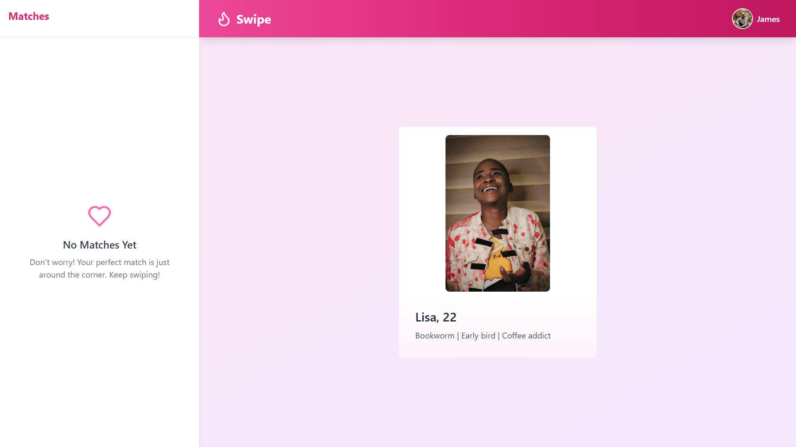
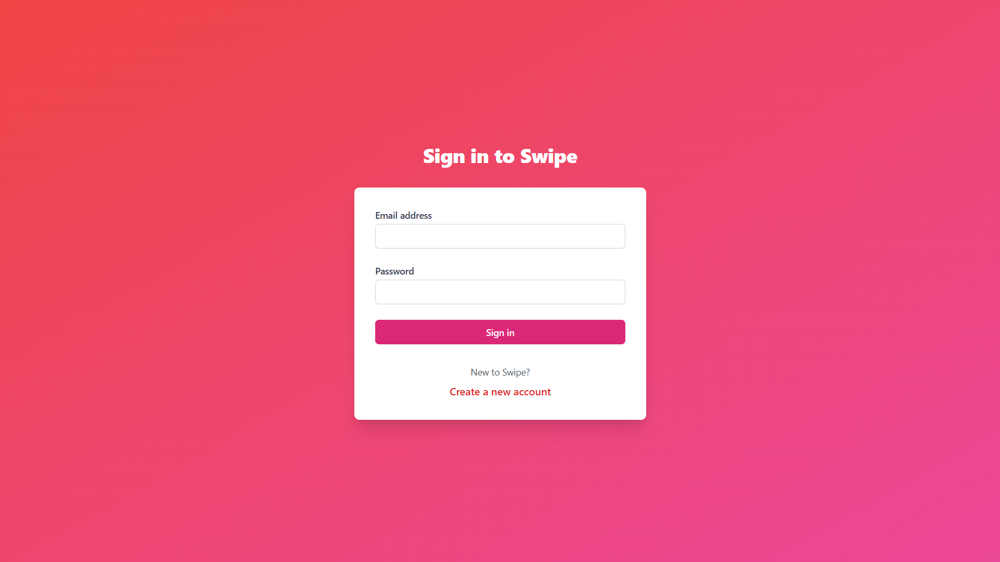
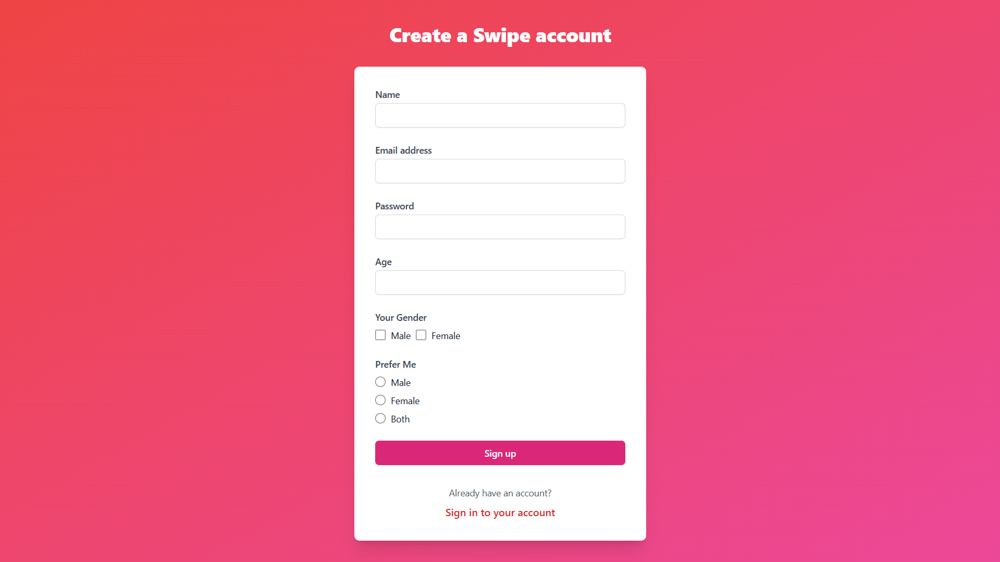
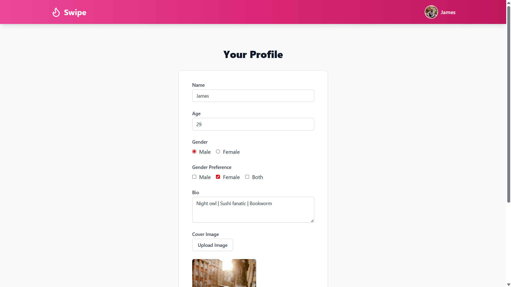
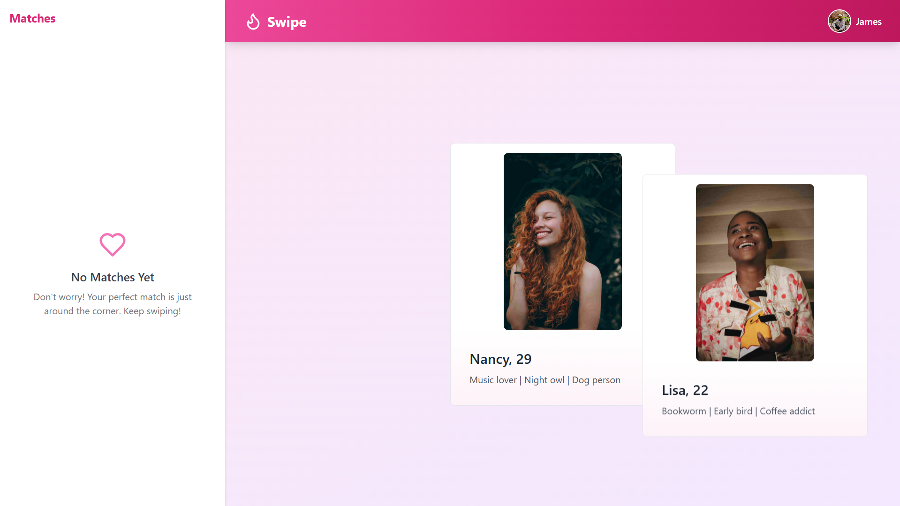

# Tinder Clone

A full-stack Tinder-like dating app built with React, Vite, Zustand, Express, MongoDB, and Socket.io.

## Features

- User authentication (signup, login, logout)
- Profile creation and editing (with image upload via Cloudinary)
- Swipe left/right to like or pass on users
- Real-time matching and messaging with Socket.io
- Responsive UI with Tailwind CSS and DaisyUI

---


```bash
PORT=5000
MONGO_URI=<YOUR_MONGODB_URI>

JWT_SECRET=<YOUR_JWT_SECRET>

NODE_ENV=development
CLIENT_URL=http://localhost:5173

CLOUDINARY_API_KEY=<YOUR_CLOUDINARY_API_KEY>
CLOUDINARY_API_SECRET=<YOUR_CLOUDINARY_API_SECRET> 
CLOUDINARY_CLOUD_NAME=<YOUR_CLOUDINARY_CLOUD_NAME>
```
---

## Screenshots

### Home Page


### Login Page


### Signup Page


### Profile Page


### Swipe Page

